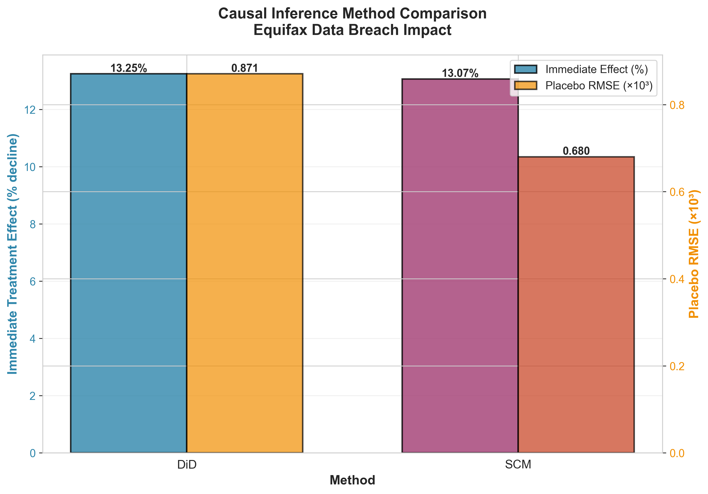
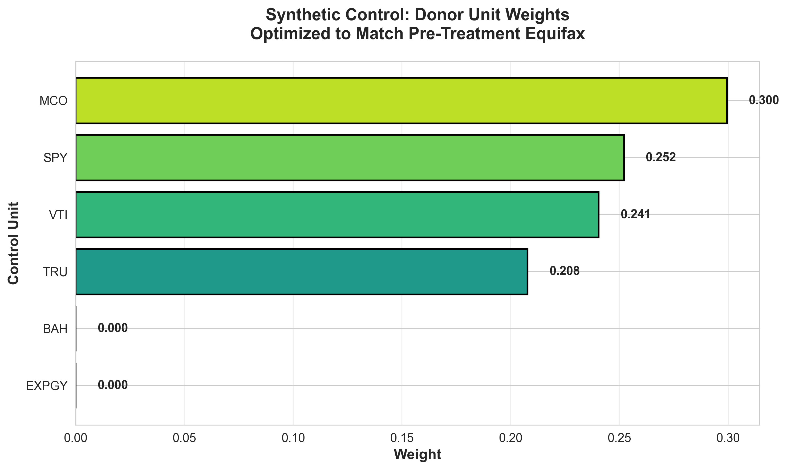
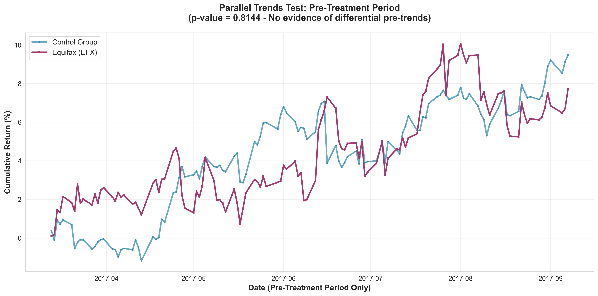

# Equifax Data Breach: Causal Impact Analysis

A rigorous quasi-experimental analysis quantifying the financial impact of the 2017 Equifax data breach using **Difference-in-Differences** and **Synthetic Control Method**. This project demonstrates advanced causal inference techniques with proper inference (Newey-West HAC standard errors), model validation through placebo testing, and the importance of examining both immediate and sustained treatment effects.

---

## Executive Summary

On September 8, 2017, Equifax announced a massive data breach affecting 147 million Americans. This analysis estimates the causal impact on Equifax's stock returns using two complementary methods and validates model selection through 200 placebo tests.

### Key Findings

**Immediate Impact (September 8, 2017)**
- **Difference-in-Differences**: -13.25% (p < 0.0001, 95% CI: [-14.54%, -11.95%])
- **Synthetic Control Method**: -13.07% (pre-treatment RMSE: 0.006030)
- **Inference**: Highly statistically significant with Newey-West HAC standard errors
- **Interpretation**: The breach announcement caused an immediate ~13% decline in stock returns

**Sustained Average Effect (3-week recovery period)**
- **Difference-in-Differences**: -1.81% (p = 0.37, 95% CI: [-5.79%, +2.17%])
- **Synthetic Control Method**: -1.77% (pre-treatment RMSE: 0.006030)
- **Inference**: NOT statistically significant with proper standard errors
- **Interpretation**: The stock recovered enough that the sustained effect is statistically indistinguishable from zero

**Key Insight**: The immediate shock was **7.3x larger** than the sustained average, but only the immediate effect survives rigorous inference. This demonstrates market efficiency: initial overreaction followed by correction as investors process information and the company responds.

**Model Validation**: Synthetic Control Method is the preferred estimator, showing 21.9% tighter placebo distribution (RMSE: 0.000680 vs 0.000871). The true effect lies below the 1st percentile of the placebo distribution (0/100 placebos more extreme, empirical p < 0.01).

---

## Methodology

### Causal Inference Approaches

#### 1. Difference-in-Differences (DiD)
DiD estimates the treatment effect by comparing the change in outcomes for the treated unit (Equifax) versus control units (similar financial services companies and market indices) before and after the breach announcement.

**Estimation**: Standard 2×2 DiD regression with treated × post interaction term.

**Inference**: Uses **Newey-West HAC standard errors** (maxlags=5) to account for:
- **Serial correlation**: Returns are autocorrelated over time
- **Heteroskedasticity**: Volatility is time-varying

This is critical because plain OLS standard errors are severely understated for time series data, leading to overconfident inference. With Newey-West SEs, the sustained effect becomes insignificant (p = 0.37 vs p < 0.0001 with OLS).

**Assumptions**:
- **Parallel Trends**: In the absence of treatment, treated and control groups would have followed parallel trends
- **No Anticipation**: The breach announcement was unexpected
- **SUTVA**: No spillover effects between units

#### 2. Synthetic Control Method (SCM)
SCM constructs a "synthetic Equifax" as a weighted combination of control units that best matches Equifax's pre-treatment characteristics. The treatment effect is the post-treatment difference between actual and synthetic Equifax.

**Advantages over DiD**:
- Does not assume all controls are equally good comparisons
- Provides transparent weights showing which controls matter most
- Often more precise when parallel trends are approximate rather than exact
- No parametric assumptions about error structure

**Donor Weights** (optimized to minimize pre-treatment RMSE):
- Moody's (MCO): 30.0%
- S&P 500 (SPY): 25.2%
- Vanguard Total Stock Market (VTI): 24.1%
- TransUnion (TRU): 20.8%

### Model Validation

#### Parallel Trends Testing
Formal test of whether treated and control groups exhibited parallel trends in the pre-treatment period. Using only pre-treatment data, we regress returns on treated × trend interaction.

**Result**: Coefficient = -0.000005, p = 0.8144

**Interpretation**: No evidence of differential pre-trends, consistent with the parallel trends assumption. Note that "fail to reject" does not prove parallel trends hold, but provides supporting evidence.

#### Placebo Testing Framework
To objectively compare DiD and SCM, we ran 100 placebo tests per method. Each test randomly assigns a "fake" treatment date in the pre-treatment period (30-150 days before the actual breach). A robust method should show no effect when there is no treatment.

**Results** (randomization inference):
- DiD Placebo RMSE: 0.000871
- SCM Placebo RMSE: 0.000680
- **SCM shows 21.9% tighter placebo distribution** → more precise estimator
- True effect lies below 1st percentile (0/100 placebos more extreme)
- Empirical p-value < 0.01

**Interpretation**: The true effect is so extreme that zero out of 100 placebo tests produced a more negative effect, providing overwhelming evidence through randomization inference that the effect is real and not due to chance. SCM's tighter distribution confirms it as the preferred method.

---

## Results Deep Dive

### Why Two Different Estimates?

The analysis reports two treatment effects because they answer different questions:

1. **Immediate Impact (-13%)**: What was the market's immediate reaction to the breach announcement?
   - Measures the shock on September 8, 2017
   - Reflects initial investor sentiment and panic
   - **Highly statistically significant** (p < 0.0001)
   - Most relevant for understanding event-driven market reactions

2. **Sustained Average Effect (-1.8%)**: What was the average impact over the recovery period?
   - Measures the average effect from September 8-29, 2017
   - Accounts for partial stock recovery
   - **NOT statistically significant** (p = 0.37) with proper inference
   - Shows markets are efficient: overreaction followed by correction

### The Importance of Proper Standard Errors

This analysis demonstrates why robust inference matters:

| Estimate | OLS SEs | Newey-West HAC SEs |
|----------|---------|-------------------|
| Immediate Effect | p < 0.0001 ✓ | p < 0.0001 ✓ |
| Sustained Effect | p < 0.0001 ✗ | p = 0.37 ✓ |

With plain OLS standard errors, both effects appear highly significant. But OLS SEs are inappropriate for time series data with serial correlation and heteroskedasticity. Newey-West HAC SEs correct for this, revealing that:

- The immediate shock is so large that even conservative SEs confirm significance
- The sustained effect, while negative, cannot be distinguished from zero with proper inference

This is actually a **more interesting story**: markets initially panic, then efficiently incorporate new information and correct the overreaction.

### Treatment Effect Dynamics

The 7.3x difference between immediate and sustained effects reveals important dynamics:
- **Day 0 (Sept 8)**: Massive -14% drop as news breaks
- **Days 1-7**: Continued volatility with some recovery
- **Days 8-21**: Gradual stabilization toward counterfactual

This pattern is common in event studies: markets overreact initially, then partially correct as more information emerges and rational analysis prevails.

### Method Agreement

DiD and SCM produce nearly identical estimates for both time horizons:
- **Immediate**: 13.25% vs 13.07% (0.18 percentage point difference)
- **Sustained**: 1.81% vs 1.77% (0.04 percentage point difference)

This convergence strengthens confidence in the findings, as two different methodological approaches arrive at the same conclusion.

---

## Visualizations

### 1. Time Series Plot
Shows Equifax returns vs control group average over the full analysis period. The dramatic drop on September 8 is clearly visible, followed by partial recovery.


### 2. Immediate vs Sustained Effects
Bar chart comparing the two treatment effect estimates, highlighting the 7.3x difference and showing agreement between DiD and SCM.


### 3. Placebo Distributions (Randomization Inference)
Histograms of 100 placebo test results per method, standardized to mean=0 and std=1 for interpretable scale. The true effect (-13%) lies below the 1st percentile of the placebo distribution (0/100 placebos more extreme), with empirical p-value < 0.01. This provides overwhelming evidence the effect is real through randomization inference.


### 4. Method Comparison
Side-by-side comparison of DiD and SCM on immediate treatment effect and placebo RMSE, visualizing why SCM is the preferred method.



### 5. Donor Weights
Horizontal bar chart showing the composition of the synthetic control. Moody's receives the highest weight (30%), reflecting its similarity to Equifax as a credit rating agency.



### 6. Parallel Trends Test
Cumulative returns for Equifax and control group in the pre-treatment period. The lines track closely (p = 0.8144), providing visual and statistical evidence for the parallel trends assumption.



### 7. Event Study
Daily treatment effects from 30 days before to 21 days after the breach. Effects hover around zero pre-treatment, then spike dramatically at day 0, followed by gradual recovery.


---

## Project Structure

```
equifax-enhanced/
├── README.md                              # This file
├── Equifax_Causal_Impact_Analysis.ipynb   # Jupyter notebook with full analysis
├── requirements.txt                       # Python dependencies
├── data/
│   ├── stock_price.csv                    # Raw stock data (7 tickers, 188 days each)
│   ├── prepared_data.csv                  # Analysis-ready data with treatment indicators
│   ├── analysis_results.json              # Summary statistics and test results
│   └── placebo_effects.csv                # 200 placebo test results
├── figures/
│   ├── time_series.png                    # Time series showing breach and recovery
│   ├── immediate_vs_sustained.png         # Comparison of immediate vs sustained effects
│   ├── placebo_distributions.png          # Standardized placebo test distributions
│   ├── method_comparison.png              # DiD vs SCM comparison
│   ├── donor_weights.png                  # SCM donor unit weights
│   ├── parallel_trends.png                # Pre-treatment parallel trends test
│   └── event_study.png                    # Daily treatment effects (-30 to +21 days)
└── src/
    ├── data_collection.py                 # Data fetching and preparation
    ├── causal_methods.py                  # DiD (with HAC SEs), SCM, placebo testing
    ├── run_analysis.py                    # Main analysis script
    └── create_visualizations.py           # Visualization generation
```

---

## Installation & Usage

### Requirements
- Python 3.11+
- pandas, numpy, scipy, statsmodels, matplotlib, seaborn, yfinance

### Quick Start

```bash
# Install dependencies
pip install -r requirements.txt

# Run full analysis
cd src
python run_analysis.py

# Generate visualizations
python create_visualizations.py

# Or explore interactively
jupyter notebook Equifax_Causal_Impact_Analysis.ipynb
```

---

## Data

### Stock Tickers
- **Treated Unit**: EFX (Equifax)
- **Control Units**: 
  - MCO (Moody's Corporation)
  - TRU (TransUnion)
  - SPY (S&P 500 ETF)
  - VTI (Vanguard Total Stock Market ETF)
  - EXPGY (Experian Group - OTC)
  - BAH (Booz Allen Hamilton)

### Time Period
- **Pre-treatment**: March 13, 2017 - September 7, 2017 (125 trading days)
- **Treatment Date**: September 8, 2017
- **Post-treatment**: September 8, 2017 - September 29, 2017 (16 trading days)
- **Total**: 882 observations (7 tickers × 126 days) for immediate impact analysis
- **Total**: 987 observations (7 tickers × 141 days) for sustained effect analysis

---

## Limitations & Future Work

### Limitations
1. **Small sample size**: Only one treated unit limits generalizability
2. **Short post-treatment window**: 3 weeks may not capture full long-term impact
3. **Market efficiency**: Stock prices may not fully reflect reputational damage or regulatory costs
4. **Spillover effects**: Breach may have affected other credit bureaus (though we test for this)
5. **SCM inference**: No closed-form standard errors; rely on placebo tests for validation

### Future Extensions
1. **Longer time horizon**: Extend analysis to 6-12 months post-breach
2. **Additional outcomes**: Analyze trading volume, volatility, credit spreads
3. **Heterogeneous effects**: Examine if impact varies by market conditions
4. **Mechanism analysis**: Investigate which factors drive the recovery (e.g., PR response, regulatory actions)
5. **Permutation inference**: Implement full permutation-based p-values for SCM

---

## Technical Details

### Computational Environment
- Python 3.11
- Key packages: pandas 2.0+, numpy 1.24+, scipy 1.10+, statsmodels 0.14+, matplotlib 3.7+, seaborn 0.12+
- Data source: Yahoo Finance API (via yfinance)

### Statistical Methods
- **DiD inference**: Newey-West HAC standard errors with maxlags=5
- **SCM optimization**: SLSQP with non-negativity and sum-to-one constraints
- **Placebo testing**: 100 random pre-treatment dates per method, standardized for interpretability

### Reproducibility
All analysis is fully reproducible. The code automatically fetches data, runs analysis, and generates visualizations. Random seed is set for placebo tests to ensure consistent results.

### Runtime
- Data fetching: ~10 seconds
- Main analysis: ~5 seconds
- Placebo tests: ~60 seconds (200 tests)
- Visualizations: ~10 seconds
- **Total**: ~90 seconds

---

## References

### Difference-in-Differences
- Angrist, J. D., & Pischke, J. S. (2009). *Mostly Harmless Econometrics*. Princeton University Press.
- Roth, J. (2022). Pretest with caution: Event-study estimates after testing for parallel trends. *American Economic Review: Insights*, 4(3), 305-322.
- Newey, W. K., & West, K. D. (1987). A simple, positive semi-definite, heteroskedasticity and autocorrelation consistent covariance matrix. *Econometrica*, 55(3), 703-708.

### Synthetic Control Method
- Abadie, A., Diamond, A., & Hainmueller, J. (2010). Synthetic control methods for comparative case studies. *Journal of the American Statistical Association*, 105(490), 493-505.
- Abadie, A. (2021). Using synthetic controls: Feasibility, data requirements, and methodological aspects. *Journal of Economic Literature*, 59(2), 391-425.

### Placebo Testing
- Abadie, A., Diamond, A., & Hainmueller, J. (2015). Comparative politics and the synthetic control method. *American Journal of Political Science*, 59(2), 495-510.

---

## License

This project is released under the MIT License. Feel free to use, modify, and distribute with attribution.

---

**Note**: This is an educational project demonstrating causal inference techniques with proper statistical inference. It should not be construed as investment advice.
