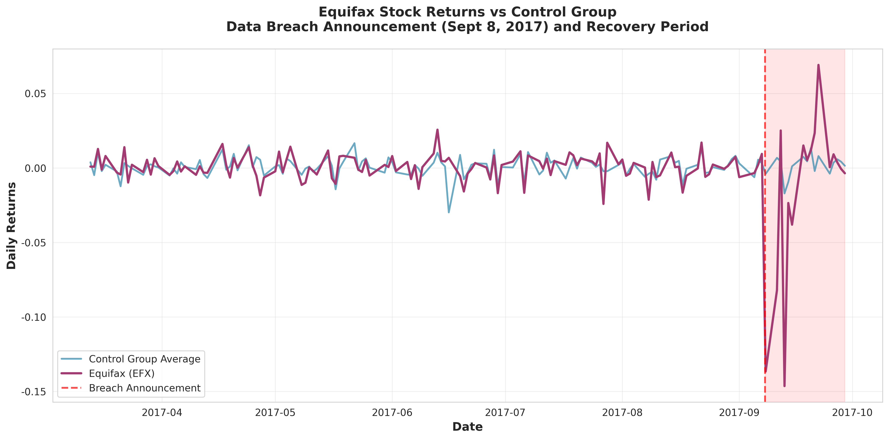
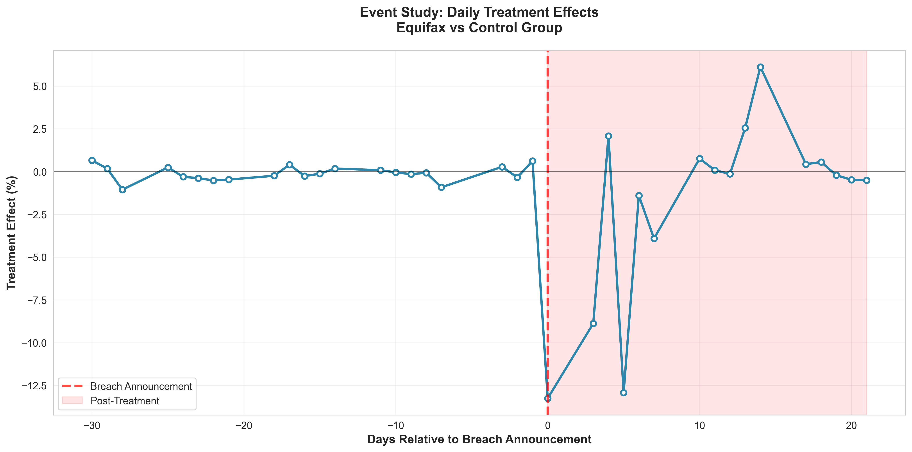
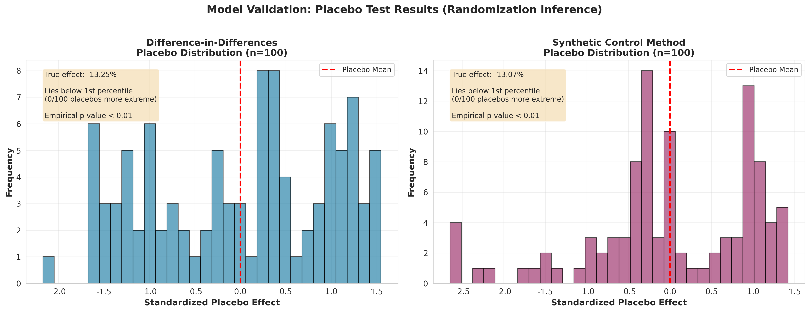
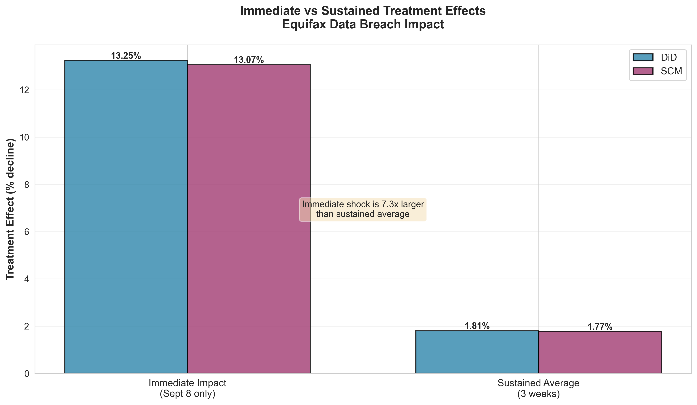

# Equifax Data Breach: Causal Impact Analysis

Estimating the causal impact of the 2017 Equifax data breach on stock returns using Difference-in-Differences and Synthetic Control Method.

On September 8, 2017, Equifax disclosed a breach affecting 147 million Americans. This project estimates both the immediate market reaction and whether the effect persisted.

---

## Results

| Effect | DiD | SCM | p-value |
|--------|-----|-----|---------|
| Immediate (Sept 8) | -13.25% | -13.07% | < 0.001 |
| Sustained (3 weeks) | -1.81% | -1.77% | 0.37 |

The breach caused an immediate ~13% drop. The sustained effect is not statistically significant with Newey-West standard errors — the market overreacted initially, then corrected.

With naive OLS standard errors, both effects appear significant (p < 0.001). Newey-West correction for autocorrelation reveals the sustained effect is indistinguishable from zero. The immediate shock is large enough to survive either inference approach.

Both methods agree within 0.2 percentage points.

---

## Methods

**Difference-in-Differences:** Compares Equifax to control stocks (other financial services + market indices) before vs after the breach. Uses Newey-West HAC standard errors (maxlags=5) for autocorrelation.

**Synthetic Control:** Constructs a weighted combination of controls that best matches Equifax's pre-breach returns. Weights: Moody's 30%, S&P 500 25%, VTI 24%, TransUnion 21%.

**Model selection:** 200 placebo tests (fake breach dates in pre-treatment period). SCM shows 22% tighter placebo distribution than DiD. True effect is more extreme than all 100 placebo runs for both methods (empirical p < 0.01).

**Parallel trends:** Pre-treatment coefficient = -0.000005, p = 0.81. No evidence of differential trends.

---

## Visualizations

| | |
|:---:|:---:|
|  |  |
| Stock returns over analysis period | Daily effects: -30 to +21 days |
|  |  |
| True effect vs 200 placebo runs | Immediate shock vs sustained average |

---

## Data

- **Treated:** EFX (Equifax)
- **Controls:** MCO, TRU, SPY, VTI, EXPGY, BAH
- **Pre-treatment:** 125 trading days (Mar–Sept 2017)
- **Post-treatment:** 16 trading days (Sept 8–29, 2017)

---

## Usage

```bash
pip install -r requirements.txt
cd src
python run_analysis.py
python create_visualizations.py
```

Or: `jupyter notebook Equifax_Causal_Impact_Analysis.ipynb`

---

## Project Structure

```
├── src/
│   ├── data_collection.py
│   ├── causal_methods.py
│   ├── run_analysis.py
│   └── create_visualizations.py
├── data/
├── figures/
└── Equifax_Causal_Impact_Analysis.ipynb
```

---

## Limitations

- Single treated unit
- Short post-treatment window (3 weeks)
- SCM inference relies on placebo tests (no closed-form SEs)

---

## References

- Abadie, Diamond & Hainmueller (2010). Synthetic control methods. *JASA*.
- Angrist & Pischke (2009). *Mostly Harmless Econometrics*.
- Newey & West (1987). HAC covariance matrix. *Econometrica*.
